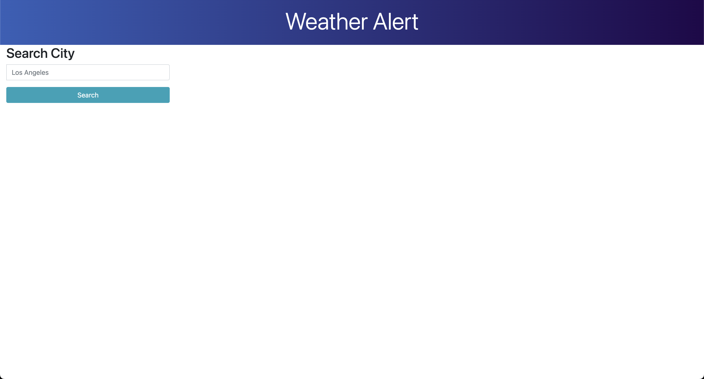
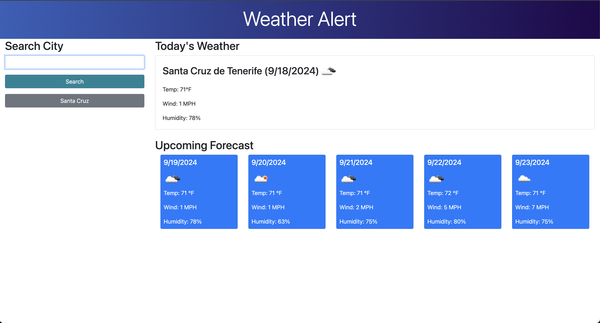
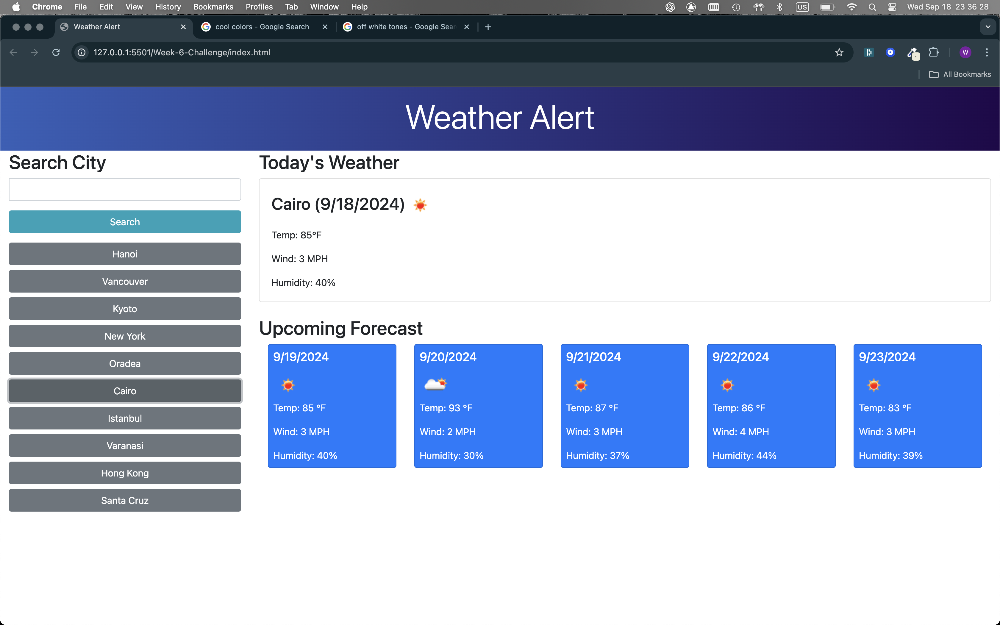

# Week-6-Challenge

## Weather Forecast

Title: Weather Alert

Description: 
I created a dynamic weather application in which users can search for any city and see a weather forecast. I used html for the static frontend, bootstrap and custom css for styling, dayjs for the dates and date formats, jquery to handle DOMContent, open weather for the weather api, and js to handle the dynamic elements of the site like handling event listeners, accessing the weather api, creating the forecast cards, and rendering everything to the page.

How to Run: 
Please click on deployed link below and you will be prompted to the main page of the application. Enter any valid city name into the search bar and click the submit button. The site will create a weather card for today's weather and forecast cards for the next five days. It will also save the inputted city and create a button with that city’s name beneath the submit button. When clicked, the forecast for that city will be displayed.

Deployed Link : https://wilsacker.github.io/Week-6-Challenge/

## Credits

Created by William Acker. Conducted searches in Google.com, https://www.w3schools.com/ and utilized ChatGPT, https://chat.openai.com/ to understand concepts.

https://coding-boot-camp.github.io/full-stack/github/professional-readme-guide was used to create the README for this project